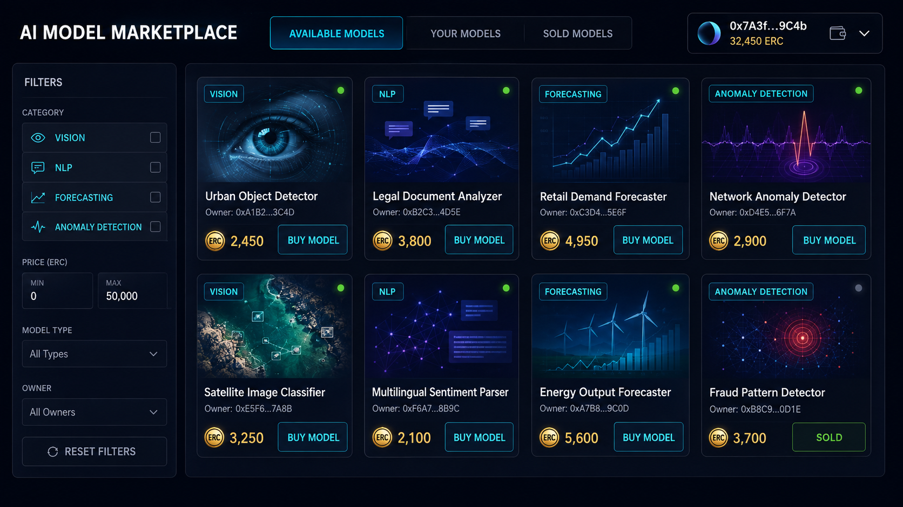
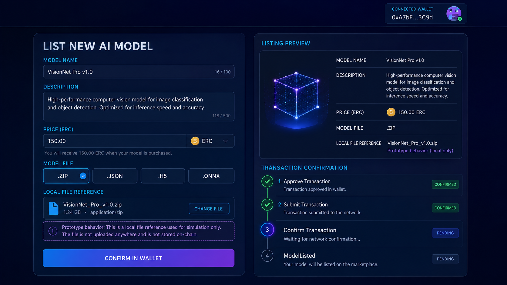
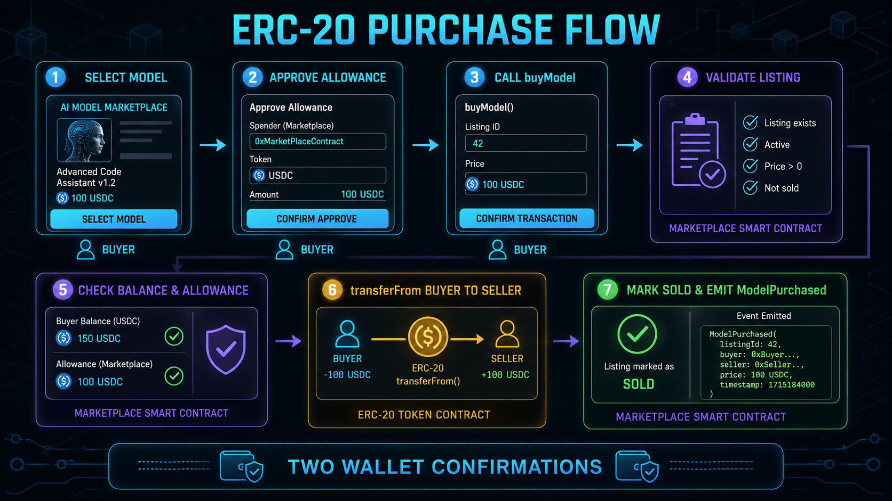
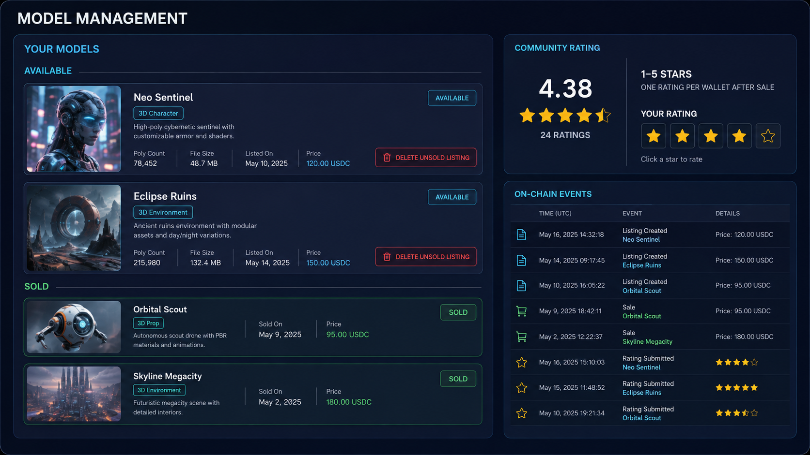
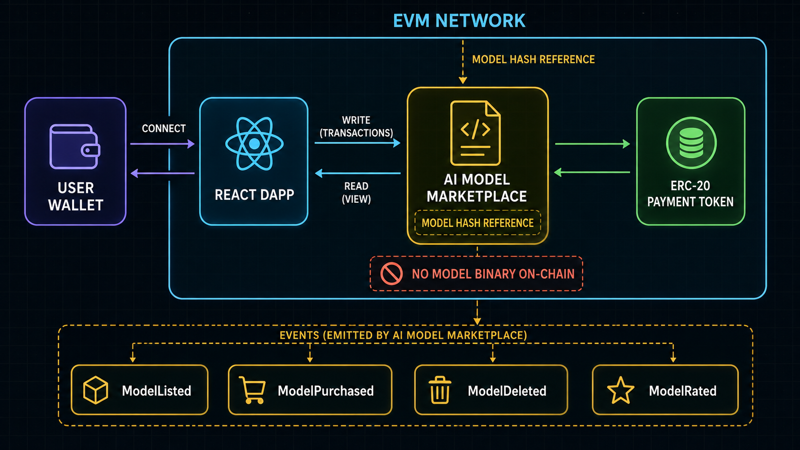
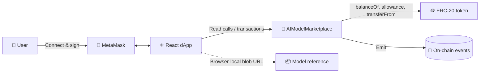

<div align="center">


# 🔗 On-Chain AI Model Ownership Marketplace

### Discover, list, purchase, manage, and rate AI-model records through an EVM marketplace

**React dashboard · MetaMask transactions · Solidity contracts · ERC-20 settlement**

[](https://soliditylang.org/)
[](https://react.dev/)
[](https://docs.ethers.org/)
[](https://metamask.io/)
[](https://www.openzeppelin.com/contracts)
[](LICENSE)

[Overview](#-overview) · [Features](#-core-capabilities) · [Architecture](#%EF%B8%8F-system-architecture) · [Contracts](#-smart-contract-reference) · [Setup](#-local-setup) · [Security](#-security--implementation-boundaries)

</div>

> [!IMPORTANT]
> This repository is an educational marketplace prototype. Its contracts are unaudited, the current frontend does not provide durable model-file storage, and the implementation does not enforce legal or cryptographic ownership transfer. Do not use it with real funds or sensitive model artifacts without completing the security and infrastructure work documented below.

## 🌐 Overview

The **On-Chain AI Model Ownership Marketplace** explores how an EVM application can coordinate AI-model listings and ERC-20 payments. Sellers create public listing records, buyers approve and transfer payment tokens, and community members can submit an on-chain rating after a listing has been sold.

The current smart contract records a seller, model metadata, price, model reference, sale state, and aggregate rating. The word **ownership** describes the product direction; the present contract does not mint an NFT, record a buyer as the new owner, enforce a license, or control access to a downloadable model.

### ✨ At a glance

| Capability | Current implementation |
|---|---|
| Wallet access | MetaMask connection through an ethers browser provider |
| Marketplace records | Name, description, price, seller, model reference, sale state, and rating totals |
| Payment rail | ERC-20 allowance followed by `transferFrom` from buyer to seller |
| Seller controls | An unsold listing can be deleted only by its seller |
| Reputation | Integer rating from 1 to 5, limited to one rating per wallet per model |
| Network target | Local Ganache or another configured EVM-compatible network |

## 🚀 Core capabilities

- 🔐 **Connect a wallet** and display the active account and token balance.
- 🧠 **Create model listings** with a name, description, ERC-20 price, and file reference.
- 🛍️ **Explore marketplace inventory** across available, personal, and sold views.
- 💸 **Purchase through ERC-20** using an approval transaction followed by `buyModel`.
- 🗑️ **Remove unsold listings** with seller-only contract authorization.
- ⭐ **Rate sold listings** from 1–5 stars, once per wallet.
- 📡 **Observe contract events** for listing, purchase, deletion, and rating activity.

## 🖼️ Visual product tour

> [!NOTE]
> The visuals below are high-fidelity concept illustrations with simulated data. They communicate the intended experience and contract flows; they are not screenshots or proof of a live deployment.

### 🛒 Marketplace discovery

Browse AI-model categories, compare prices and ratings, and distinguish available inventory from sold listings.



### 📝 Create a listing

Enter listing metadata, choose a supported local file type, review the details, and confirm the blockchain transaction in the connected wallet.



> The current frontend converts the selected file into a browser-local `blob:` URL. It does **not** upload the file to IPFS, a server, or the blockchain, so the reference is not durable across sessions.

### 💳 ERC-20 purchase lifecycle

Purchasing requires two wallet confirmations: one for the ERC-20 allowance and another for the marketplace purchase transaction.



### ⭐ Rating and seller management

Sellers can delete their unsold records, while sold records become eligible for a 1–5 star on-chain rating.



## 🏗️ System architecture





| Layer | Responsibility |
|---|---|
| **React UI** | Wallet state, marketplace views, listing form, purchase, deletion, and rating actions |
| **ethers.js** | Browser provider, contract calls, transaction signing, and token-unit conversion |
| **MetaMask** | Account access and explicit user confirmation for every state-changing transaction |
| **`AIModelMarketplace`** | Listing state, seller checks, sale state, ERC-20 purchase flow, and rating aggregation |
| **ERC-20 contract** | Token balances, allowances, and buyer-to-seller settlement |
| **EVM network** | Contract execution, transaction history, and event logs |

### 🔄 Listing lifecycle

```text
Draft metadata
      │
      ▼
listModel(name, description, price, modelHash)
      │
      ▼
Available listing ──────► Seller may delete it
      │
      ├── ERC-20 approve(marketplace, price)
      └── buyModel(modelId)
              │
              ▼
          Sold listing ──────► Eligible for wallet-based rating
```

## 🧾 On-chain data model

Each `AIModel` record contains:

| Field | Type | Purpose |
|---|---|---|
| `id` | `uint256` | Sequential listing identifier |
| `name` | `string` | Public model name |
| `description` | `string` | Public listing description |
| `price` | `uint256` | Payment-token amount in base units |
| `seller` | `address` | Wallet that created the listing |
| `modelHash` | `string` | Public model/file reference supplied by the frontend |
| `isSold` | `bool` | Whether the listing has completed a purchase |
| `exists` | `bool` | Soft-delete flag for the record |
| `totalRating` | `uint256` | Sum of submitted rating values |
| `ratingCount` | `uint256` | Number of submitted ratings |

### 📡 Contract events

| Event | Emitted when |
|---|---|
| `ModelListed` | A seller creates a new listing |
| `ModelPurchased` | ERC-20 settlement succeeds and the listing is marked sold |
| `ModelDeleted` | The seller deletes an unsold listing |
| `ModelRated` | A wallet submits its first valid rating for a sold listing |

## 📜 Smart contract reference

### `AIModelMarketplace.sol`

| Function | Access | Behavior |
|---|---|---|
| `listModel(name, description, price, modelHash)` | Any wallet | Creates a listing when `price > 0` |
| `deleteModel(id)` | Listing seller | Soft-deletes an existing, unsold listing |
| `buyModel(id)` | Non-seller wallet | Checks balance and allowance, transfers tokens to seller, then marks the listing sold |
| `rateModel(id, rating)` | Any wallet not yet rated | Accepts 1–5 only after the listing is sold |
| `getModelRating(id)` | Read-only | Returns the integer average, or zero when unrated |
| `getAvailableModels()` | Read-only | Returns existing listings that are not sold |
| `getModelCount()` | Read-only | Counts records whose `exists` flag is true |
| `getTokenBalance(account)` | Read-only | Reads the configured ERC-20 balance |

### `AITU_Nurassyl.sol`

The sample payment contract extends OpenZeppelin ERC-20, mints the configured initial supply to the deployer, and exposes the token identity `AITU_SE-2318_Token` (`AITUSE`). It is a development token, not a production payment asset.

## 🧰 Technology stack

| Area | Technology |
|---|---|
| Frontend | React 18, React Router, React Bootstrap, Bootstrap |
| Web3 integration | ethers.js, MetaMask |
| Smart contracts | Solidity 0.8.20, OpenZeppelin `IERC20` / `ERC20` |
| Development tooling | Truffle, Hardhat packages, Ganache |
| Testing | Truffle contract tests and React Testing Library |

## 📁 Project structure

```text
ai-model-marketplace/
├── contracts/
│   ├── AIModelMarketplace.sol   # Listings, purchases, deletion, ratings
│   └── AITU_Nurassyl.sol        # Development ERC-20 payment token
├── frontend/
│   ├── public/
│   └── src/
│       ├── components/          # Shared navigation and UI elements
│       ├── pages/
│       │   ├── Home.js          # Catalog, purchase, delete, and rating views
│       │   └── ListModel.js     # Listing form and local file reference
│       ├── App.js               # Wallet/provider orchestration
│       └── config.js            # Contract addresses and ABIs
├── migrations/                  # Truffle deployment migrations
├── scripts/deploy.js            # Deployment script
├── test/                        # Contract tests
├── package.json
└── truffle-config.js
```

## ⚙️ Local setup

### Prerequisites

- Node.js 18+ and npm
- MetaMask browser extension
- Ganache or another development EVM network
- A funded development wallet for gas and test ERC-20 tokens

### 1. Clone the portfolio repository

```bash
git clone https://github.com/AsadAliEngineer/On-Chain-AI-Model-Ownership-Marketplace.git
cd On-Chain-AI-Model-Ownership-Marketplace
```

### 2. Complete the required pre-flight fixes

The current source snapshot needs alignment before it can be treated as a reproducible build:

1. Remove every hard-coded network credential from configuration, rotate exposed values, and load secrets from ignored environment variables.
2. Set the selected compiler toolchain to Solidity `0.8.20` or a compatible version.
3. Choose and configure one deployment workflow—Truffle or Hardhat—then update the tests to the current contract API.
4. Add the frontend's imported direct dependencies (`ethers` and `react-router-dom`) to `frontend/package.json`.
5. Deploy the token first and the marketplace second, passing the token address into the marketplace constructor.
6. Replace the frontend contract addresses and ABIs with the artifacts from that deployment.

### 3. Install dependencies

```bash
npm install
cd frontend
npm install
npm install ethers react-router-dom
```

### 4. Configure MetaMask

Add the development network to MetaMask, import or fund a development-only account, and ensure the wallet is connected to the same chain where both contracts were deployed.

### 5. Start the frontend

```bash
npm start
```

The React development server normally opens at `http://localhost:3000`.

> [!WARNING]
> These commands describe the intended local workflow. They are not a claim that the current snapshot builds without the pre-flight fixes above.

## 🧪 Usage workflow

### 🔐 Connect

1. Open the dApp and select **Connect Wallet**.
2. Approve the MetaMask account request.
3. Confirm that the intended development network and account are active.

### 🧠 List a model

1. Open **List Model**.
2. Enter the model name, public description, and token price.
3. Select a `.zip`, `.json`, `.h5`, or `.onnx` file.
4. Confirm `listModel` in MetaMask.

Never select a confidential model in the current prototype: the file is not durably uploaded, while the submitted reference string is public blockchain data.

### 💸 Buy a listing

1. Select an available model listed by another wallet.
2. Confirm the ERC-20 `approve` transaction.
3. Confirm the marketplace `buyModel` transaction.
4. Wait for settlement; the token contract transfers payment directly from buyer to seller.

### ⭐ Rate or manage

- Submit a 1–5 rating after a listing is marked sold.
- Delete your own listing only while it remains unsold.
- Review emitted events for an auditable activity trail.

## 🔒 Security & implementation boundaries

### What the prototype enforces

- ✅ A listing price must be greater than zero.
- ✅ A seller cannot buy their own listing.
- ✅ A listing cannot be bought twice or deleted after sale.
- ✅ Only the listing seller can delete an unsold record.
- ✅ Balance and allowance are checked before token transfer.
- ✅ A wallet can rate a sold listing only once, from 1 to 5.

### What still requires engineering

- ⚠️ **No durable storage:** the current `blob:` file reference is session-local; integrate authenticated object storage, IPFS, or another verifiable persistence layer.
- ⚠️ **No access control:** payment does not unlock, encrypt, license, or deliver the model artifact.
- ⚠️ **No buyer ownership record:** `buyModel` marks the listing sold but does not store a buyer or transfer legal/cryptographic ownership.
- ⚠️ **Ratings are not buyer-gated:** any wallet may rate a sold listing once; the contract does not verify that the rater purchased it.
- ⚠️ **Public metadata:** strings written to a public chain are visible permanently; never place model binaries, secrets, private URLs, or access tokens in `modelHash`.
- ⚠️ **External token call:** `transferFrom` occurs before `isSold` is updated; obtain a professional reentrancy and token-behavior review before deployment.
- ⚠️ **Credential hygiene:** remove hard-coded provider credentials and private keys, rotate any previously exposed values, and use environment-based secret management.
- ⚠️ **Enumeration edge case:** `getModelCount()` returns the number of existing records, not the highest ID; clients that loop from `1..count` can miss later listings after a middle record is deleted.
- ⚠️ **Gas scalability:** storing long strings and scanning every historical ID becomes expensive as inventory grows.
- ⚠️ **Marketplace controls:** production use still needs pause controls, escrow/refunds, dispute handling, license terms, royalties, monitoring, and an independent audit.

## 🧭 Production roadmap

- [ ] Replace local blob references with content-addressed, durable storage.
- [ ] Encrypt model artifacts and release buyer-specific access after finality.
- [ ] Record purchases and explicit license/entitlement data on-chain.
- [ ] Restrict ratings to verified purchasers and support richer review moderation.
- [ ] Add `ReentrancyGuard`, emergency pause controls, and adversarial contract tests.
- [ ] Replace unbounded enumeration with indexed events or pagination.
- [ ] Unify the compiler, deployment, ABI, and test toolchains.
- [ ] Add CI for contract tests, frontend tests, linting, and dependency scanning.
- [ ] Complete an external smart-contract audit before any value-bearing deployment.

## 🤝 Contributing

1. Fork the repository.
2. Create a branch: `git checkout -b feature/your-feature`.
3. Add focused tests for every contract or UI change.
4. Commit your work: `git commit -m "Add your feature"`.
5. Push the branch and open a pull request.

Please never commit wallet keys, seed phrases, RPC secrets, or funded credentials.

## 📚 Origin, credits & license

This portfolio presentation is based on the open-source [`nur1kesh/ai-model-marketplace`](https://github.com/nur1kesh/ai-model-marketplace) project by **Nurassyl Amantur**. Credit for the original implementation remains with its author and contributors.

Distributed under the **MIT License**. Review the repository's [`LICENSE`](LICENSE) file before reuse or redistribution.

## 👨‍💻 Developer

<table>
  <tr>
    <td width="150" align="center">
      <br>
      <strong>Asad Ali</strong>
    </td>
    <td>
      <strong>AI, Blockchain & Software Engineer</strong><br><br>
      🐙 GitHub: <a href="https://github.com/AsadAliEngineer">@AsadAliEngineer</a><br>
      📧 Email: <a href="mailto:asadalieng1107@gmail.com">asadalieng1107@gmail.com</a><br>
      🚀 Focus: intelligent systems, Web3 products, automation, and production-oriented engineering
    </td>
  </tr>
</table>

---

<div align="center">

### ⭐ If this project helps you, consider starring the repository

**Built with Solidity, React, ethers.js, and a commitment to transparent engineering.**

</div>
